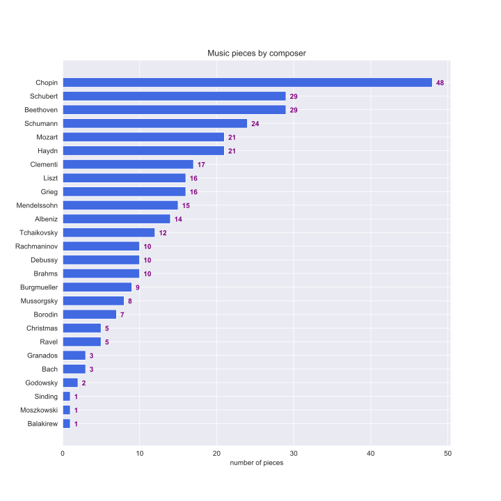

# ClassicalPianoMIDI-dataset
Classical Piano MIDI dataset at http://www.piano-midi.de/

Last updated in August, 2021.

## Statistics

The dataset contains 337 classical piano pieces from 25 composers + 1 for Christmas songs, the total duration is 23.17 hours.

## Metadata

Please find metadata in `metadata.csv`.

